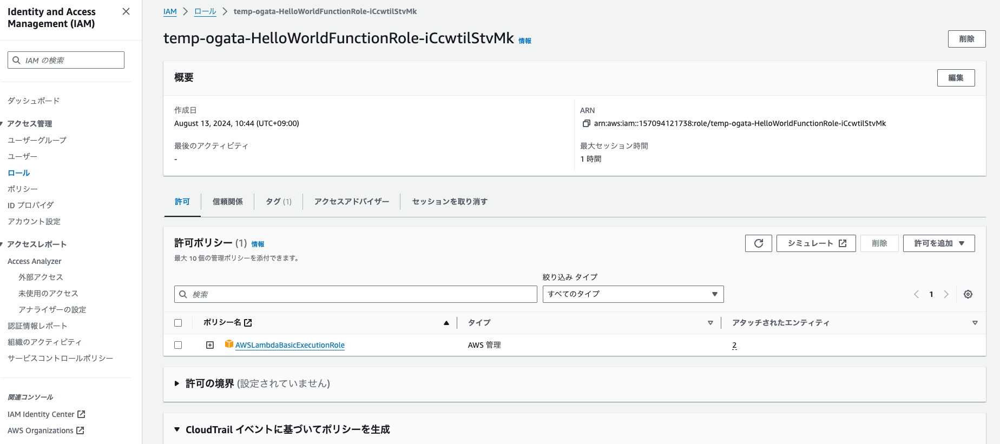

# AWS-SAM

<details open="open">
<summary>目次</summary>


- [今回のシステム概要図](#今回のシステム概要図)
- [samのセットアップ、ローカル確認](#samのセットアップ、ローカル確認)
- [SMAを使って初回deploy](#SMAを使って初回deploy)
- [リリース済みのリソースのUPDATE](#リリース済みのリソースのUPDATE)
- [作成したリソースの削除](#作成したリソースの削除)
- [備考](#備考)
- [参考](#参考)
</details>

# 今回のシステム概要図
<details>
<summary> システム概要図</summary>


</details>

# samのセットアップ、ローカル確認

<details>
<summary> 0. sam-cliのインストール</summary>

- 下記コマンドでインストール

```zh
   brew tap aws/tap
   brew install aws-sam-cli
```

</details>


<details>
<summary> 1.samのディレクトリのセットアップ</summary>

- 下記コマンドで好きなランタイムでセットアップ
- Which template source would you like to use? -> 1
- Choose an AWS Quick Start application template -> 1
- Select your starter template -> 2
- 後はNoでOK

```zh
sam init --runtime nodejs18.x
```

</details>

<details>
<summary> 2.必要な変更を加える</summary>

- 好きにラムダ関数をかく
- デフォルトでルート直下にapp.tsが配置されて、使いづらいので、「controller」などのフォルダに切り分けた場合は、template.yamlの参照先も変更が必要


</details>

<details>
<summary> 3.ローカルでの確認</summary>

- 下記コマンドでlocalhost:3000で起動する。dynamoDBローカルなど、別のdocker-composeで起動しているコンテナと連携するためには --networkの設定が必須
- 今回は make sam-localでビルドとスタートの両方を実施するMakefileを準備した

```zh
sam build
sam local start-api
```

</details>


# SMAを使って初回deploy

<details>
<summary> 1. 認証情報を登録</summary>

- ToroHandsOnのtemporaryのアクセスキーをターミナルの環境変数に設定
- リージョンを東京に設定

```zh
export AWS_DEFAULT_REGION=ap-northeast-1
```

</details>

<details>
<summary> 2. sam buildを実行</summary>

- ターミナルでsam buildを実行

```zh
sam build
```

</details>

<details>
<summary> 3. sam deployをする</summary>

- ターミナルで sam deployを実行
- 全てYesでOK
- Deploy this changeset? [y/N]: yと聞かれるのでyesでAPIゲートウェイ、Lambdaをデプロイ
- デフォルトで作成されるIAMロールは、添付のようにLambdaBasicがアタッチされている

```zh
sam deploy --guided
```



</details>

<details>
<summary> 4. deployされたAPIゲートウェイへアクセスする</summary>

- deploy完了時に、下記の表示がターミナルである。このドメインへアクセスして問題なくデプロイされていることを確認する
- デフォルトで、ステージはstageとprodが出来上がっているよう。添付参照

```zh
Key                 HelloWorldApi                                                                                                                                                                     
Description         API Gateway endpoint URL for Prod stage for Hello World function                                                                                                                  
Value               https://pivy15kyd1.execute-api.ap-northeast-1.amazonaws.com/Prod/hello/   
```


</details>

# リリース済みのリソースのUPDATE

<details>
<summary> 1. 下記コマンドを実行</summary>


```zh
sam build
sam deploy --no-confirm-changeset --no-fail-on-empty-changeset
```

</details>

<details>
<summary> 2. そもそも --guide使わずに、いきなりリソース作りながらデプロイする</summary>

- 下記を実施しても、APIGatewayのエンドポイントは変わらないので、実質Updateできる
- 最初に、samconfig.tomlの「stack_name, s3_prefix, region」など対話中に聞かれる値を設定しておく
- 後は下記のデプロイコマンドを実行。今回は make sam-deployでまとめて実行できるようにしている


```zh
sam build
sam deploy --no-confirm-changeset --no-fail-on-empty-changeset
```

</details>

# 作成したリソースの削除

<details>
<summary> 1. 下記コマンドで削除</summary>


```zh
sam delete --stack-name <スタックネーム>
```

</details>


# 備考
[samの記事1](https://zenn.dev/toccasystems/articles/aws-sam-setup?redirected=1)

# 参考


